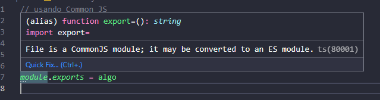
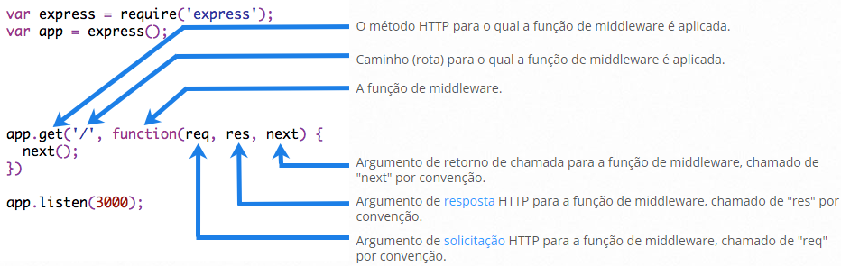
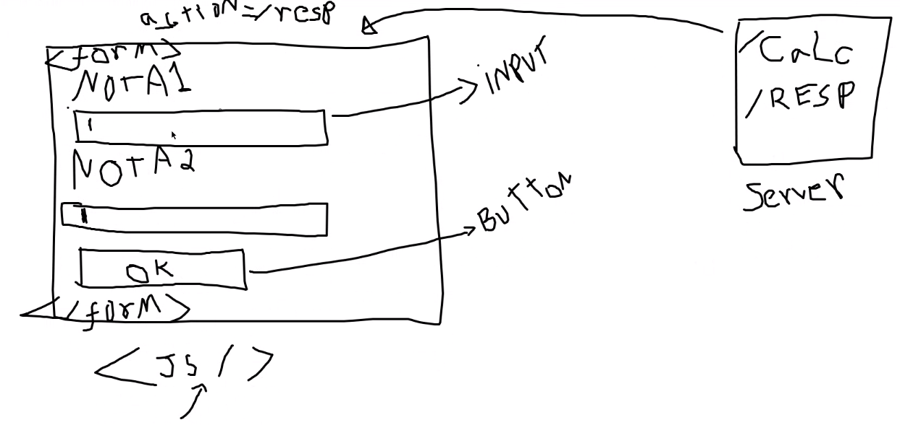
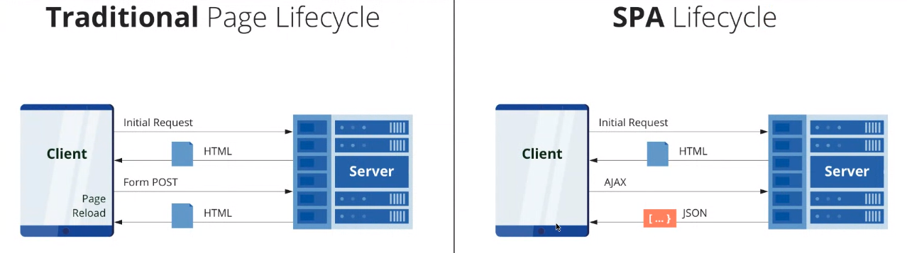
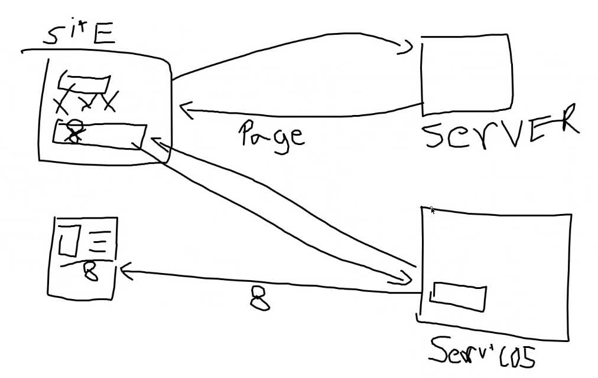

# NodeJS aprendido com Grupo de Estudos do UniAcademia

## Intro

Plataforma que permite desenvolver aplicações no backend com JS.  
Reutiliza estrutura da linguagem JavaScript para executar o backend de programas.

JavaScript que roda na máquina (não no browser)  
Possui muitas bibliotecas (módulos) que permitem expandir as funcionalidades do node.

Site --> Request --> Aplicação Node  
Aplicação Node --> HTTP/response --> Site

Módulo **Nodemon**  
Sempre que houver mudanças ele roda o código novamente.

> npm run nome_script

Desde 2018, JavaScript vem evoluindo (ECMA Script6) - nessa versão foi alterada a forma de importação.

Existem duas formas de importação:

1. Common XES6 (padrão do node)
2. ECMA (aceito no node, desde que seja feita uma configuração)

<!-- 1. É possível exportar duas ou mais funções?
2. Posso exportar variáveis?
   a. let nome 'XPTO'
3. Entender diferença nas formas de importação -->

## Imports, Exports e Padrão ECMA

Modelo de importação atual = **CommonJS**  
Usa sintaxe clássica do _require()_ no topo de módulos Node.js, mas não é suportado oficialmente pelos browsers sem plugins externos.

> const variavel = require('./modulo')



ESM (ECMAScript Modules)

Para usar o ECMA é necessário um transpire - converte o código na versão atual para uma versão antiga.  
Por exemplo, Babel.  
Outra forma seria usar o ECMA na vesão experimental.

Formas de criar um ECMA script modules:

- Finalizar arquivo com _.mjs_ (opção antiga)  
  (caso seja arquivo common, usar _cjs_)
- Adicionar no package.json um atributo _type_ com valor _module_  
  Identifica que está sendo usado o _ECMA Script 6_ (ou superior)

### O que foi feito

Para importar utilizando ECMA: adicionar **"type":"module"** no _package.json_.  
Para manter uma importação utilizando Common no projeto: alterar a extensão do arquivo para _.cjs_

**Importante**: para importar com ECMA foi necessário adicionar a extensão dos arquivos na importação:

> import somethin from './export.js'

## Uso original do JavaScript

Dentro do HTML, com elementos da página:

> document.getElementById  
> addEventListener  
> r.innerHTML

Para importar foi necessário adicionar a tag _type: "module"_ no script (html):  
`<script type="module" src="script.js"></script>`

Padrão dos browsers é a versão mais atual de importação, ECMA.  
O padrão do NodeJS é a importação CommonJS.

Se forem carregados dois arquivos de script o browser considera como um só (une as funções), então é possível utilizar normalmente as funções dos outros arquivos.  
 Não é interessnte pois carrega o arquivo inteiro - sendo que as vezes necessito apenas de uma função.

## Objetos

- Usar funções dentro dos objetos (arrow function)
- Criar classe
  Na classe crio atributos (variaveis), métodos e importo a classe para usar as variaveis

---

**Front-End**: HTML, CSS, JS  
**Back-End**: Gerar páginas dinâmicas - Node  
**Framework**: Torna as coisas mais simples.

_Express Framework_  
Framework Node que vai criar aplicações Web.

> _npm install express_  
> Baixa a biblioteca e instala no projeto (uso apenas no projeto atual)

> _npm install express --save_  
> Baixa na máquina globalmente e permite ser usado em qualquer projeto

Express cria um servidor, que fica rodando na máquina (porta 9000) e responde páginas definidas.

Inicializando o projeto, cria um arquivo _index.js_  
No package.json criado, pode configurar o _index.js_ como arquivo principal.

**Tarefa**: Criar um mini projeto com Express (igual exemplo);  
Utilizar inicialmente apenas os GET (definição dos caminhos da URL).



//TODO [Learn Express](https://youtu.be/JlgKybraoy4)

## Páginas Dinâmicas

Todo site precisa de um servidor para a comunicação e troca de arquivos (HTML, CSS, JavaScript).

- Páginas estáticas: conteúdo fixo (independetende de qualquer mudança)
- Páginas dinâmicas: conteúdo pode mudar de acordo com variáveis

Usando EJS para criar páginas dinâmicas:

```
app.set('view engine', 'ejs');
app.set('views', './views');

app.get('/', (req, res) => {
    res.render('home');
});
```

> npm install ejs

**Tarefa**: Criar uma calculadora;  
JavaScript deve estar na página  
Na página calculadora: se clicar em OK com campos em branco, alterar cor do botão (algo para indicar)
JS no cliente trata de manipulações na página  


**OBS:** JavaScript != NodeJS  
JavaScript faz validação de páginas
NodeJS usa como base o JavaScript mas faz o tratamento dos dados no servidos (back-end)

Metodos de envio do formulário

_method = "get"_: Informações são enviadas pela URL (o nome dessa variável vem do parametro _name_)  
Google consegue mapear informações via GET - pois está na URL

Para informações mais fechadas, usa-se o _POST_ - A informação vai via cabeçalho de requisição.
Para acessar esses dados utiliza-se o _req.body_

```
app.post('/resp', function (req, res) {
    console.log(req.body)
    let num1 = parseFloat(req.body.nota1)
    let num2 = parseFloat(req.body.nota2)
    res.render('template', { page: "response",
                            resp: num1 + num2
                            })
})
```

No formulário:

```
<form id="formNotas" onSubmit="return trata()" action="/resp" method="post">
```

### Formas de resposta de página no Node:

- Tradiconial (Page x Response): a página te devolve uma outra página completa (HTML inteiro)  
  A vantagem é que as páginas conseguem ser mapeadas no google (devido a mudança de URL)  
  Não há processamento no cliente - o sevidor faz todo o processamento
- SPA - Single Page Application
  A primeira vez que o site é acessado carrega todo HTML;  
  Depois disso, ele devolve elementos na página (o endereço da URL se mantém o mesmo);  
  Ha processamento maior no cliente (nem sempre o cliente tem uma máquina capaz desse processamento)



**Atividade**: Devolver dois serviços, um devolvendo apenas o time e outro devolvendo o time e jogadores

```
Time de Futebol {
	Nome do time
	Data de fundação
	Etc...
	Jogadores {
		Nome
		Posição
		Salário
	}
}
```

Criar página, onde a primeira página lista todos os times.  
Clicando no link do time virão todos os jogadores do time.

A **mesma página** em um momento mostra todos os times, em outro mostra os jogadores (mesma URL).

_Ao invés de devolver uma pagina, irá devolver um JSON_

Retorno em JSON:  
Forma mais simples (objeto/json declarado no main):

```
Forma 1:
res.json({ objeto: objetoCarro });

Forma 2:
res.setHeader('Content-Type', 'application/json');
res.end(JSON.stringify({ objeto: objetoCarro }, null, 3));
```

Obs: Parametros _null_ e _3_ são para apresentar o json formatado.  
null = replacer (substituição de algum valor)  
3 = espaçamento (o que formata o trem)

## Serviços

Sites e Aplicativos usam um mesmo serviço para executar uma ação - mas retornam coisas diferentes.  
Servidor Web devolve uma página com HTML, CSS e JS (dados em uma página).  
Um aplicativo recebe apenas o valor desejado (dado como Notas, Saldo, Faltas, etc)

Utilizando o mesmo serviço o dado fica consistênte, sendo necessário atualizar apenas em um lugar.  
Exemplo: _Uso de serviços / microserviços_:


Criar um serviço para o cálculo de IMC  
_localhost:9000/imc/100/1.8_

- 100 = Peso
- 1.8 = Altura
- ?nome = Zezin

Retorno = Json contendo nome e IMC

_ex.get("/imc/{peso}/{altura}")_
